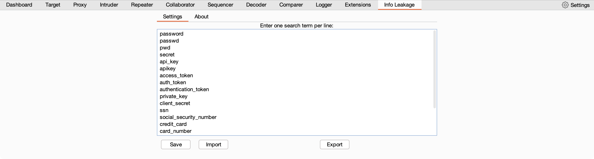

<p align="center">
<h1 align="center">Info Leakage</h1></p>

Info Leakage is a Burp Suite extension designed to perform passive security testing against web applications using Burp Suite. Specifically, it searches for instances of sensitive strings in the response body of HTTP requests, and flags them as potential information leakage vulnerabilities.

The Info Leakage extension allows users to define a list of strings to search for, and when a match is found, it creates a custom scan issue containing details of the vulnerability, such as the name of the string that was found and the severity of the issue.

To improve the efficiency of the testing process, the extension also includes a method to consolidate duplicate issues. This ensures that issues with the same name and detail are not reported multiple times, which can help to reduce false positives and streamline the testing workflow.

Overall, this Burp extension provides a simple but effective way to identify potential information leakage vulnerabilities in web applications, helping security professionals to better protect their systems and data.



## Requirements

Ensure you have Burp Suite installed on your system. You can download the free Community edition or purchase the Professional edition from the official website: https://portswigger.net/burp

Make sure you have the Jython Standalone JAR file on your system. You can download it from the Jython website: https://www.jython.org/download

If you need to setup Jython you can follow these steps:
1. Open Burp Suite and go to the "Extender" tab.

2. Click on the "Options" sub-tab.

3. Under the "Python Environment" section, locate the "Folder for loading modules" field and set it to the directory where the Jython Standalone JAR file is stored. Alternatively, you can click "Select file..." and browse to the location of the Jython Standalone JAR file.

## Installation

1. Download ```Info Leakage.py```

2. Open Burp Suite and go to the "Extender" tab.

3. Click on the "Extensions" sub-tab.

4. Click the "Add" button, and in the "Add extension" dialog, select "Python" from the "Extension type" dropdown.

5. Click "Select file..." and browse to the location where you have saved the ```Info Leakage.py``` Python script for the Burp Suite extension.

Click "Next" to load the extension. If everything is configured correctly, you should see a message that says "Extension loaded successfully." You should now see the extension listed in the "Loaded extensions" section.

## Usage

Now the extension is installed, and you can use it to find information leakages based on the search terms defined in the "Settings" tab of the extension UI. Add search terms on the Info Leakage tab, one per line, and save.

The ```sensitive_info_terms.json``` file provides 20 sensitive information terms that you can search for in HTTP responses. Keep in mind that this list is not exhaustive, and it's essential to adjust the search terms based on the specific application or environment you are testing. This file can be imported in the Info Leakage tab under settings.

When using these search terms, it's important to understand that false positives can occur. Be sure to carefully review and validate each finding to ensure it's a legitimate information leakage.

<b>Limitation</b>: The Info Leakage extension cannot passively intercept and scan HTTP responses when the Burp Proxy is in invisible mode. However, initiating an active scan in Burp can be used as an alternative method to scan the responses for the search terms.

***Check out my other Burp Suite extension [Findings Tracker](https://github.com/marksowell/Findings-Tracker)***

## License
The scripts and documentation in this project are released under the [MIT License](LICENSE)
